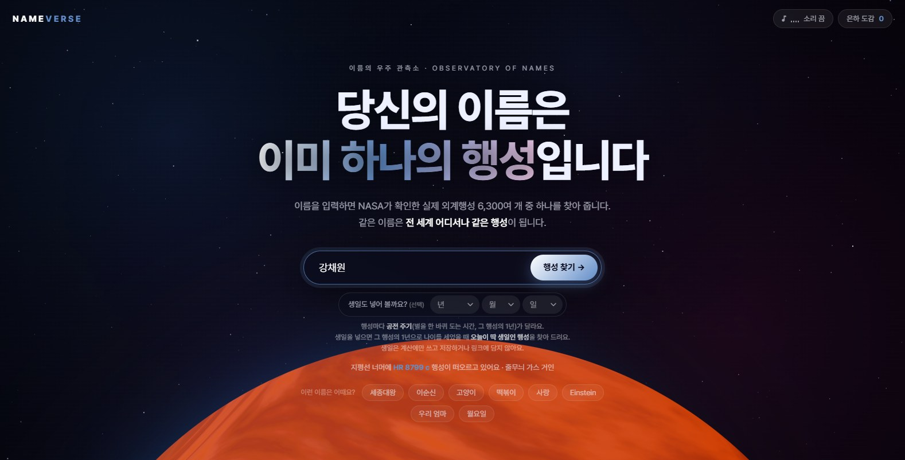
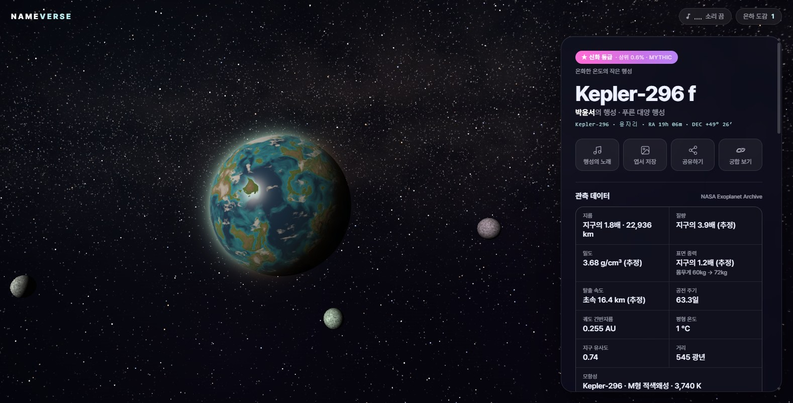
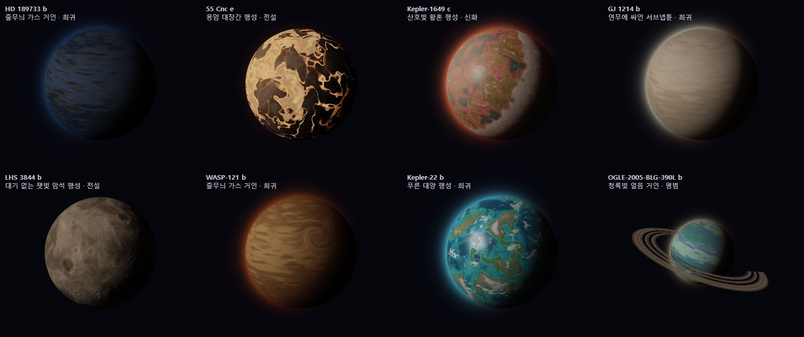
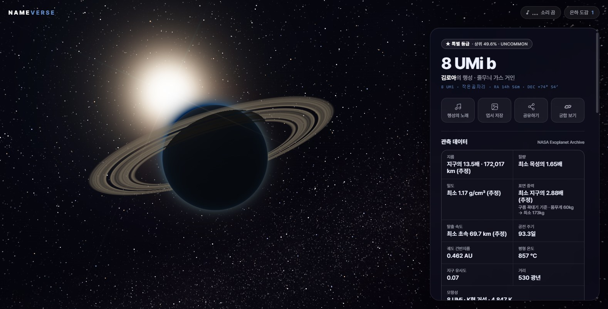

<p align="center">
  
</p>

# NAMEVERSE — 이름의 우주

이름을 입력하면 NASA가 확인한 **실제 외계행성 6,306개** 중 하나가 당신의 행성이 됩니다.
같은 이름은 전 세계 어느 기기에서 입력해도 **완전히 같은 행성**입니다. 서버도, API 키도, 빌드 도구도 없이 정적 파일만으로 돌아갑니다.



**▶ 링크: https://fillddak.github.io/nameverse/**

## 실행

위 주소로 접속하면 PC와 모바일 어디서든 바로 열 수 있습니다.

로컬에서는 `index.html`을 더블클릭해 Chrome이나 Edge로 열면 됩니다.

> 로컬 서버로 띄우고 싶다면 `python -m http.server` 또는 `npx serve .`를 쓰면 됩니다.

## 해볼 것들



| 동작 | 결과 |
| --- | --- |
| 이름 입력 | 한 글자를 칠 때마다 지평선 너머의 행성이 바뀌고, 워프를 지나 그 행성에 도착합니다 |
| 생일 넣기 (선택) | 그 행성의 1년으로 나이를 세었을 때 **오늘이 딱 생일인 행성**을 찾아 줍니다 |
| 드래그 · 휠 (모바일: 손가락 · 핀치) | 행성 회전 · 확대. 오른쪽 드래그나 두 손가락 드래그는 시점 이동, 더블클릭은 처음 시점으로 |
| **행성 클릭 / 탭** | 그 지점이 바다인지, 산인지, 폭풍의 눈인지 알려 주는 지표 탐사 |
| ☀ 모항성을 실제 크기로 보기 | 시점을 돌려 그 행성의 하늘에서 별이 실제로 얼마나 크게 보이는지 보여 줍니다 |
| 🌃 상상 속 도시 불빛 | 생명이 살 수 있는 행성에서만, 켜면 밤 쪽에 도시 불빛이 켜집니다 |
| 행성의 노래 | 행성마다 선법과 화성이 다른 앰비언트 음악을 실시간으로 작곡합니다 |
| 궁합 보기 | 두 사람의 행성을 나란히 띄우고, 실제 거리와 1년의 길이를 비교합니다 |
| 엽서 저장 · 공유하기 | 1080×1350 발견 증명서 PNG와 `#n=이름` 링크. 받은 사람도 같은 행성을 봅니다 |
| 은하 도감 | 이 기기에서 발견한 행성을 모아 둡니다 |

**단축키:** `M` 음악 켜기/끄기 · `/` 이름 입력창으로 · `Esc` 열린 창 닫기

## 실제 데이터로 고르는 모습



행성의 모습은 난수가 아니라 **실제 반지름·질량·받는 빛의 양**으로 정해집니다.

- **가스 거인**의 색은 온도에 따라 구름을 이루는 물질이 바뀌는 다섯 등급(암모니아 → 물 → 맑은 파랑 → 알칼리 흡수 → 규산염)을 따릅니다.
- **암석 행성**은 대기를 지켰는지(우주 해안선), 생명 가능 영역의 어디쯤인지로 용암 · 대기 없는 암석 · 화성형 사막 · 금성형 · 온화한 행성 · 빙하로 나뉩니다.
- 뜨거운 곳은 **흑체 복사로 스스로 빛나고**, 별에 붙잡혀 한쪽만 바라보는 행성은 낮과 밤의 온도 차를 그대로 그립니다.
- 고리와 위성은 관측된 적이 없어 상상이지만, 고리는 태양계처럼 드물게, 위성은 부서지지 않는 거리에만 둡니다.

희귀도(평범 · 특별 · 희귀 · 전설 · 신화)는 생명 가능 영역의 암석 행성, 가까운 이웃, 직접 촬영처럼 **실제로 드문 특징**으로 6,306개의 순위를 매긴 것입니다. 이름이 행성을 고르게 고르므로 "상위 X%"는 문자 그대로 사실입니다.

## 그 행성에서 본 하늘



- **우리 태양**이 그 행성의 하늘에서 어느 별자리 쪽에 몇 등급으로 보이는지 알려 주고, 하늘에도 띄웁니다. (프록시마 b에서는 카시오페이아자리의 0.4등급 별)
- **은하수**는 실제 은하면을 따라, 은하 중심인 궁수자리 쪽이 가장 밝게 그립니다.
- 같은 항성계의 **이웃 행성**은 관측된 트랜싯 시각으로 계산한 오늘의 실제 궤도 위치에 초승달이나 밝은 점으로 뜹니다.
- 붉은 별 아래 맑은 대기는 파랗지 않고 희뿌옇게, 오로라는 대기의 기체에 따라 초록 · 청보라 · 분홍으로 빛납니다.

<details>
<summary><sub>특이한 행성을 만나는 이름들</sub></summary>

<br>

| 이름 | 행성 | 볼거리 |
| --- | --- | --- |
| 오시우 | 51 Peg b | 태양 같은 별에서 처음 발견된 외계행성 (1995) |
| 류슬기 | PSR B1257+12 c | 처음 확인된 외계행성계. 빛 없는 펄서를 돌고, 극지방에 오로라가 늘 일렁입니다 |
| 한다은 | TRAPPIST-1 f | 일곱 행성계. 하늘에 이웃 행성들이 뜨는 보랏빛 식물의 행성 |
| 장철수 | LHS 1140 b | 별을 마주한 쪽만 녹은 '눈알 행성' |
| 권하은 | Kepler-1649 c | 붉은 별 아래 붉게 물든 식물의 행성 |
| 박윤서 | Kepler-296 f | 위성 셋을 거느린 푸른 대양 행성 |
| 강채원 | HR 8799 c | 직접 사진에 찍힌, 스스로 빛나는 젊은 거대 행성 |
| 이예준 | SR 12 AB c | 두 별을 함께 돌아 하늘에 해가 두 개 |
| 강도현 | HD 189733 b | 실제로 관측된 짙은 파란색의 뜨거운 목성 |
| 정서준 | WASP-76 b | 낮 쪽이 스스로 달아오르는 초고온 목성 |
| 김철수 | V1298 Tau b | 솜사탕처럼 부푼 초저밀도 행성 (밀도 0.09) |
| 김민준 | Kepler-1385 b | 별을 마주한 쪽이 마그마 바다인 용암 행성 |
| 김지우 | GJ 9827 c | 대기를 잃고 크레이터만 남은 잿빛 암석 |
| 김은우 | TOI-1052 b | 짙은 연무에 싸인 서브넵튠 |
| 김수아 | K2-415 b | 두꺼운 구름에 덮인 금성형 행성 |
| 김미영 | Kepler-712 c | 고리 달린 청록빛 얼음 거인 |
| 김로아 | 8 UMi b | 해보다 23배 크게 보이는 거성 (☀ 실제 크기로 보기) |

</details>

## 어떻게 만들었나

- **이름 → 행성** — 이름을 해시(cyrb128)해 만든 난수(sfc32)로 행성을 고르고 모습을 정합니다. 기능마다 독립된 난수 스트림을 써서, 새 기능을 더해도 기존 행성의 모습이 바뀌지 않습니다.
- **데이터** — NASA Exoplanet Archive의 확인된 외계행성 목록을 빌드 스크립트로 받아 JS 파일 하나에 담았습니다. 비어 있는 값은 질량-반지름 관계식 등으로 채우고 화면에 (추정)으로 표시합니다.
- **렌더링** — WebGL 프래그먼트 셰이더로 행성·대기·고리·위성·일식을 레이트레이싱합니다. 행성 종류마다 필요한 부분만 담은 셰이더를 비동기로 컴파일해, 처음 접속할 때도 브라우저가 멈추지 않습니다.
- **지표 탐사** — 셰이더의 노이즈 함수와 판정 식을 JS로 그대로 옮겨, 화면에 보이는 것과 탐사 결과가 일치합니다.
- **소리** — 샘플 파일 없이 Web Audio API로 패드, 아르페지오, 베이스, FM 벨을 실시간으로 합성합니다.

## 파일 구성

```
index.html                 화면 뼈대
css/style.css              스타일 (데스크톱 · 모바일 바텀시트)
js/exoplanets.js           NASA 외계행성 목록 (tools/build-exoplanets.js가 생성)
js/seed.js                 해시 + 난수, 기능별 독립 난수 스트림
js/genesis.js              이름 → 실제 행성 → 모습, 관측·상상 기록, 희귀도, 궁합
js/planet-gl.js            WebGL 레이트레이싱 렌더러, 하늘, 클릭 판정
js/surface.js              지표 탐사와 지명 생성
js/music.js                생성 음악
js/starfield.js            별밭, 별똥별, 워프
js/postcard.js             공유용 엽서
js/app.js                  화면 흐름, 라우팅, 입력
tests/genesis.test.js      생성기 검사 (결정성, 1만 개 이름, 물리 판정)
tests/gallery.html         개발용: 여러 행성을 한 화면에 (?planets=HD 189733 b|55 Cnc e)
tests/shader-timing.html   개발용: 셰이더 컴파일 시간 측정
tools/build-exoplanets.js  NASA에서 목록을 받아 js/exoplanets.js 생성
docs/                      README용 스크린샷
```

테스트: `node tests/genesis.test.js`

데이터 출처: [NASA Exoplanet Archive](https://exoplanetarchive.ipac.caltech.edu/) (2026-09-25 기준) · 별자리 경계: IAU (Roman 1987)

> ⚠️ 이름과 행성의 연결은 `js/exoplanets.js`의 행 순서와 `js/genesis.js`의 난수 호출 순서에 달려 있습니다. 목록을 새로 받으면 공유된 링크의 행성이 바뀌므로, 열을 더할 때는 행 순서를 지키는 `node tools/build-exoplanets.js --append`를 쓰고, 새 기능의 난수는 `root.fork('새이름')`으로 따로 뽑으세요.

요구 사항: WebGL을 지원하는 브라우저 (최신 Chrome, Edge, Firefox, Safari).
